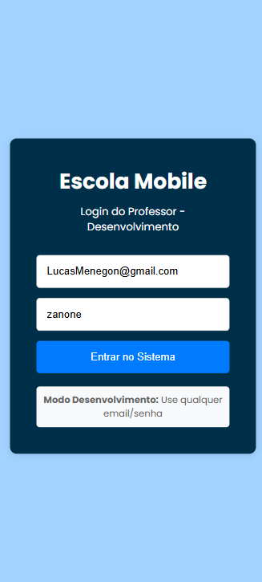
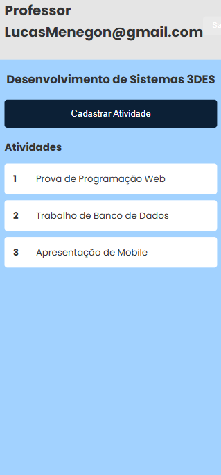
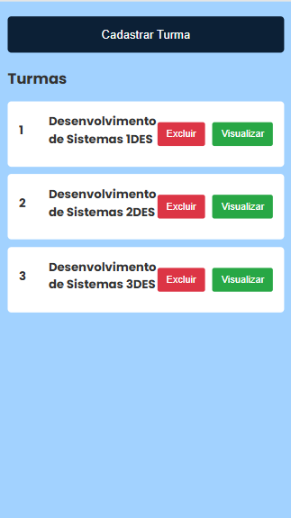
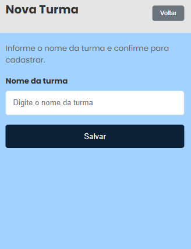

Feito por Lucas Menegon  
AULA 06 DE MOBILE — 24 de outubro de 2025

## Descrição
Projeto de aula que demonstra telas e funcionalidades desenvolvidas durante a disciplina de Mobile. Este repositório contém a aplicação móvel criada durante a aula, com capturas de tela das telas implementadas.

## Tecnologias utilizadas

- React Native (Expo) ou React Native CLI
- Node.js (>= 14)
- TypeScript / JavaScript
- VS Code
- Bibliotecas comuns: React Navigation, Axios, AsyncStorage

## Como executar (exemplo usando Expo)
1. Abra o terminal na pasta do projeto:
   - cd c:\Users\Instrutor\Desktop\Mobile6Escola
2. Instale dependências:
   - npm install
3. Inicie o Metro bundler / Expo:
   - expo start
4. Rode no emulador ou dispositivo:
   - Expo Go (escaneie o QR) ou
   - npx react-native run-android

## Screenshots
Telas desenvolvidas durante a aula:

 
 

## Autor 
Lucas Menegon
